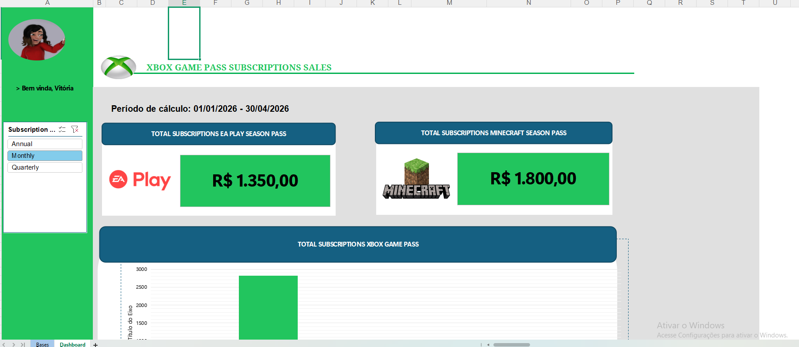
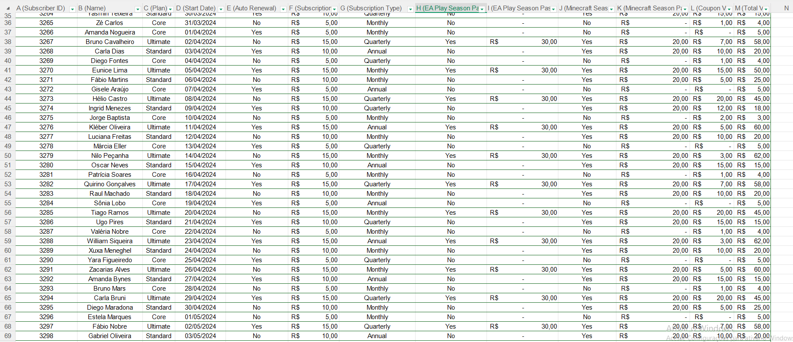
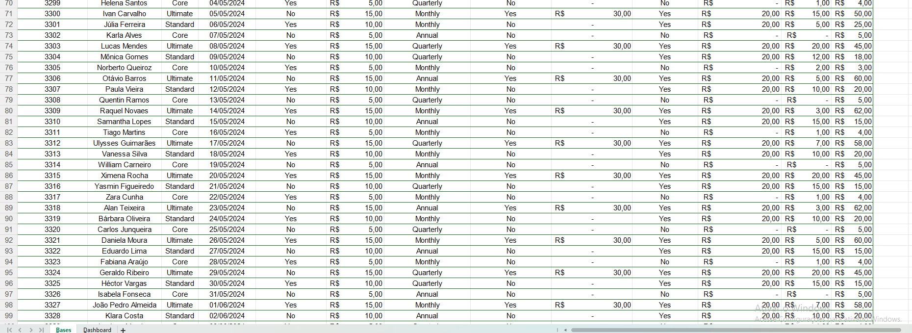

Projeto do desafio da Digital Innovation One sobre dashboard de vendas do XBOX com Excel

O professor Felipe Aguiar explica o passo a passo do que deve ser feito e cria a dashboard juntamente com o aluno, ele dá a planilha referente a vendas de planos no XBOX GAME PASS, MICROSOFT SEASON PASS e EA PLAY SEASON PASS e o objetivo
É pegar a quantidade de vendas dos tipos planos e exibir os valores de vendas de cada um em uma dashboard de forma organizada, coesa e simples onde qualquer pessoa que tiver acesso consiga entender. 

O intuito do projeto é auxiliar o aluno a criar excelentes dashboard para o ramo empresarial entregando dados relevantes de maneira organizada e limpa. Essa ferramenta auxilia como análise de dados e assim conseguindo posicionar melhores métricas 
em vendas. Quanto melhor for a organização do Dashboard melhor o resultado dos dados.

---

Aqui abaixo segue a planilha utilizada de modelo para o genrecimento dos dados no dashboard

---

---

A captura de tela da dashboard criada

---

Duas imagens dos dados, o restante está na planilha mencionada acima, apenas para uma ideia dos dados utilizados

